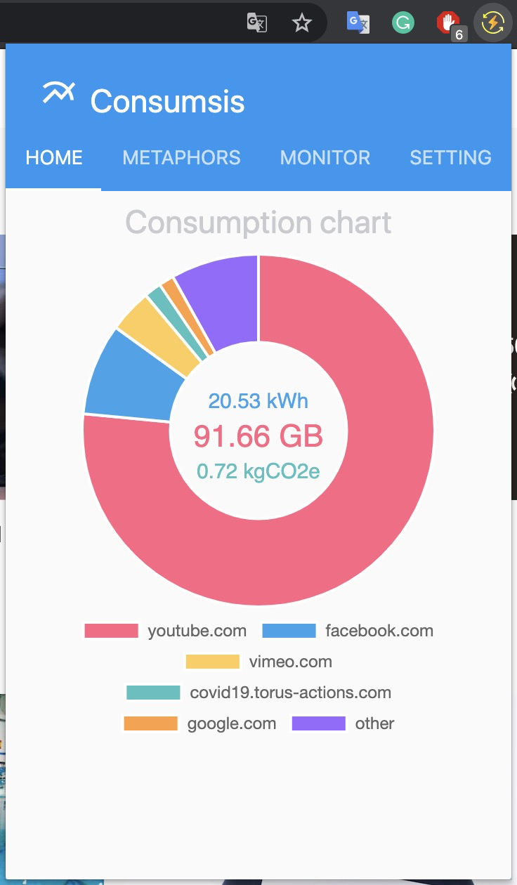
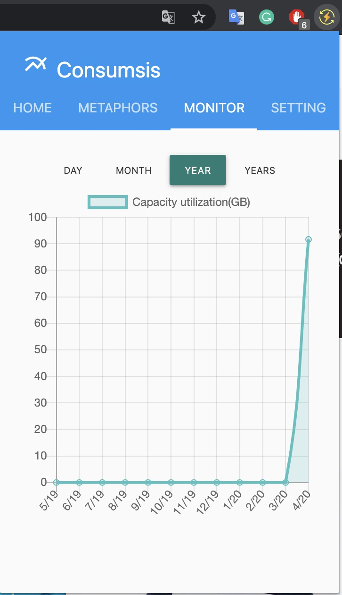
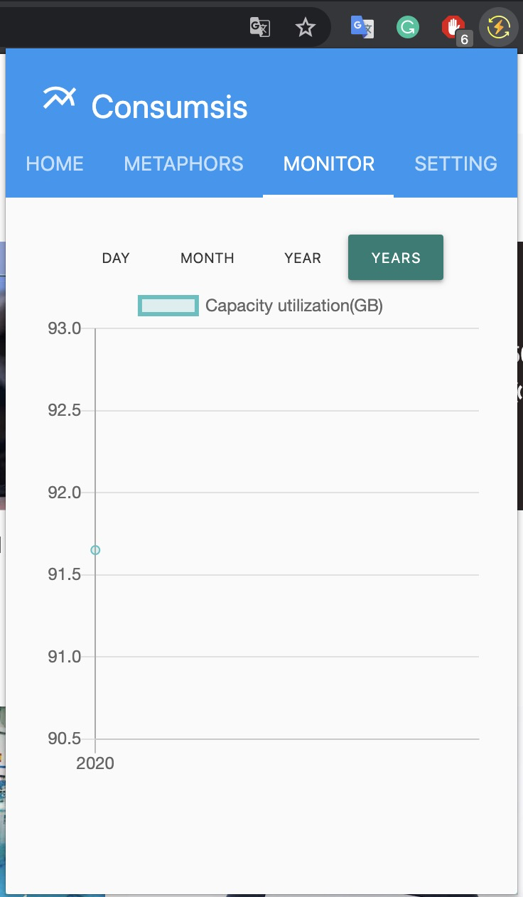
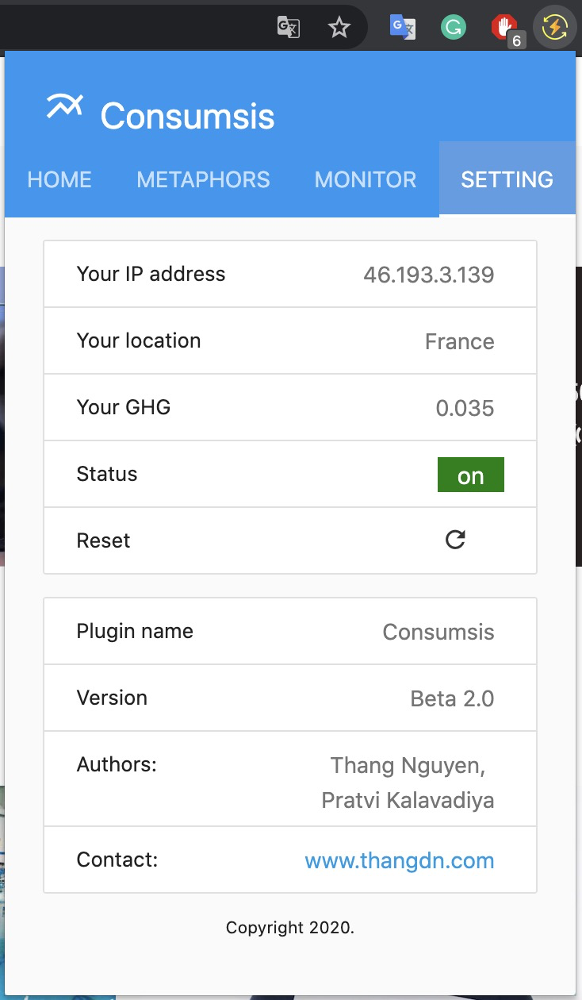
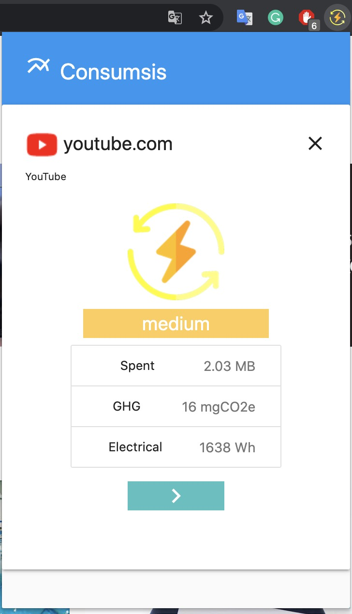
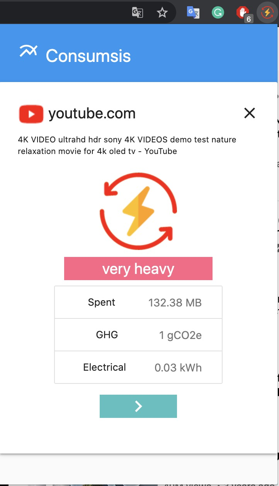
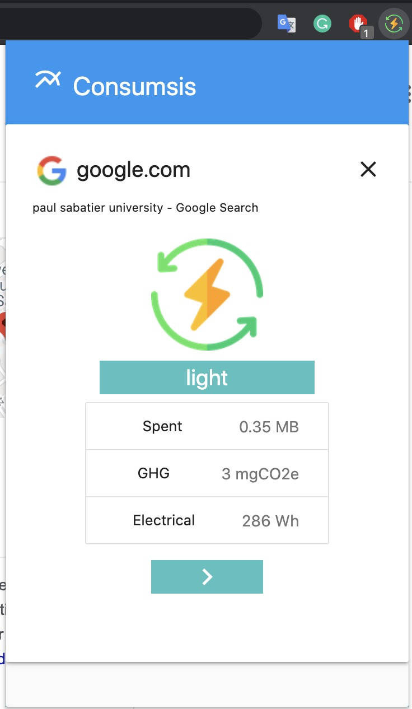
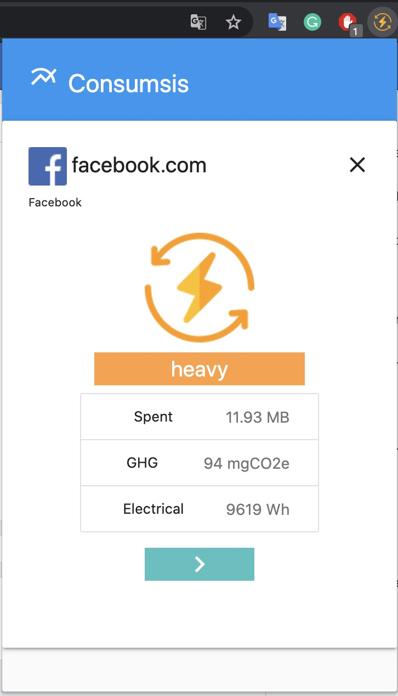

# Consumsis plugin for chrome browser
### Version: 2.0.0
### Authors: Thang Nguyen and Pratvi
### Email: thangdn.tlu@gmail.com

Consumsis plugin will track and measure data utilization on your browser and show up:
- Data utilization
- The top websites are the most consumption.
- The number of data, number of electrical, and number of Carbon dioxide. 
- Propose some metaphors to easy to understand.
- Show the current website is light or weight consumption.
- Show the data (hourly, daily, monthly, even years).

## Images
{:height="240px"}

